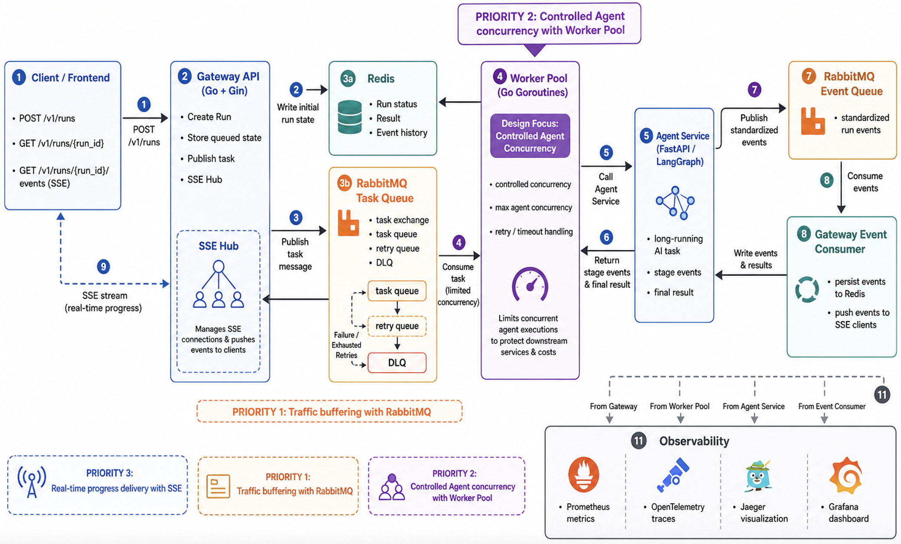
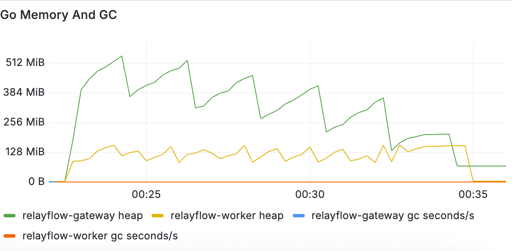
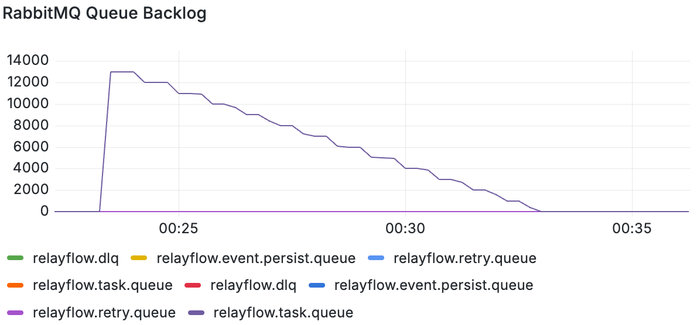
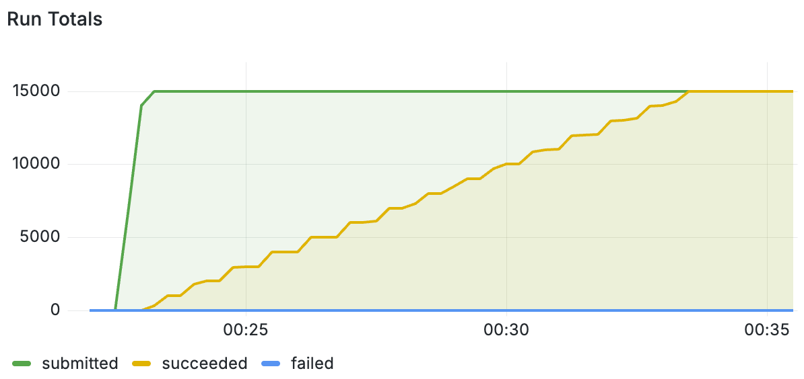
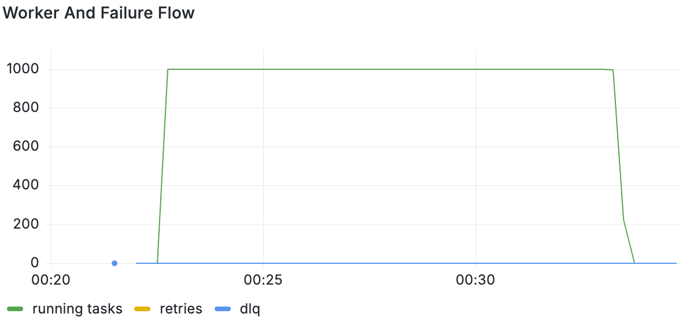

# RelayFlow

[English](README_EN.md) | [中文](README.md)

RelayFlow is a reliable asynchronous relay layer for long-running Agent tasks. It wraps low-concurrency, long-running, and unstable Agent services into an async task flow that is queueable, retryable, queryable, and observable.

Its core goal is to decouple frontend connection concurrency from backend Agent execution concurrency. The Gateway accepts high-concurrency HTTP/SSE requests and quickly enqueues tasks, while Workers consume tasks with a controlled concurrency limit and invoke downstream Agent services.

## Features

- Async task submission: `POST /v1/runs` returns a `run_id` immediately
- SSE progress delivery: `GET /v1/runs/{run_id}/events`
- Traffic buffering with RabbitMQ task queues
- Worker-side concurrency control for protecting low-throughput Agent services
- Redis-backed run status, result, and event history storage
- Timeout handling, retry, and dead-letter queue support
- Standardized Agent stage events through a RunEvent model
- Prometheus metrics and OpenTelemetry distributed tracing

## Architecture



## Tech Stack

- Go, Gin
- RabbitMQ
- Redis
- Prometheus
- OpenTelemetry, Jaeger
- FastAPI demo Agent
- Docker Compose

## Quick Start

Start infrastructure services:

```bash
docker compose -f docker-compose.infra.yml up -d
```

Start the demo Agent service:

```bash
docker compose -f docker-compose.agent.yml up -d --build
```

Start Gateway and Worker:

```bash
docker compose -f docker-compose.relay.yml up -d --build
```

## API Usage

Create an async run:

```bash
curl -X POST http://127.0.0.1:8080/v1/runs \
  -H 'Content-Type: application/json' \
  -d '{
    "agent_id": "langgraph",
    "input": {
      "prompt": "Check today weather in Beijing"
    }
  }'
```

Example response:

```json
{
  "run_id": "run_xxx",
  "status": "queued"
}
```

Query run status:

```bash
curl http://127.0.0.1:8080/v1/runs/{run_id}
```

Subscribe to run events:

```bash
curl -N http://127.0.0.1:8080/v1/runs/{run_id}/events
```

Example SSE events:

```text
event: running
data: {"run_id":"run_xxx","seq":1,"type":"running","message":"task started"}

event: succeeded
data: {"run_id":"run_xxx","seq":5,"type":"succeeded","message":"task succeeded"}
```

## Load Testing

Under a `2C2G` resource limit, RelayFlow was load-tested with `15,500` simulated users submitting tasks and subscribing to SSE progress events. Worker concurrency was set to `1000` to simulate the maximum backend Agent execution concurrency. The full run completed in about `13` minutes with no request failures, normal SSE connection release, and no observed goroutine or connection leaks.

### Runtime Memory

Go memory stayed stable during the test, with no continuous growth or abnormal GC pressure.



### Queue Backlog

RabbitMQ backlog stayed controllable while Workers consumed tasks at the configured concurrency, then gradually drained as tasks completed.



### SSE Connections and Completed Runs

SSE connections increased as users were spawned and were released normally after task completion. Completed runs grew steadily.



### Worker Concurrency

Worker running tasks remained stable around the configured `1000` concurrency limit, keeping backend Agent pressure within the expected range.



## Notes

- RelayFlow does not manage Agent business logic, conversation memory, or tool invocation. It only provides the reliability layer around async task execution.
- RabbitMQ is used for task messages and low-frequency semantic stage events, not for token-level streaming.
